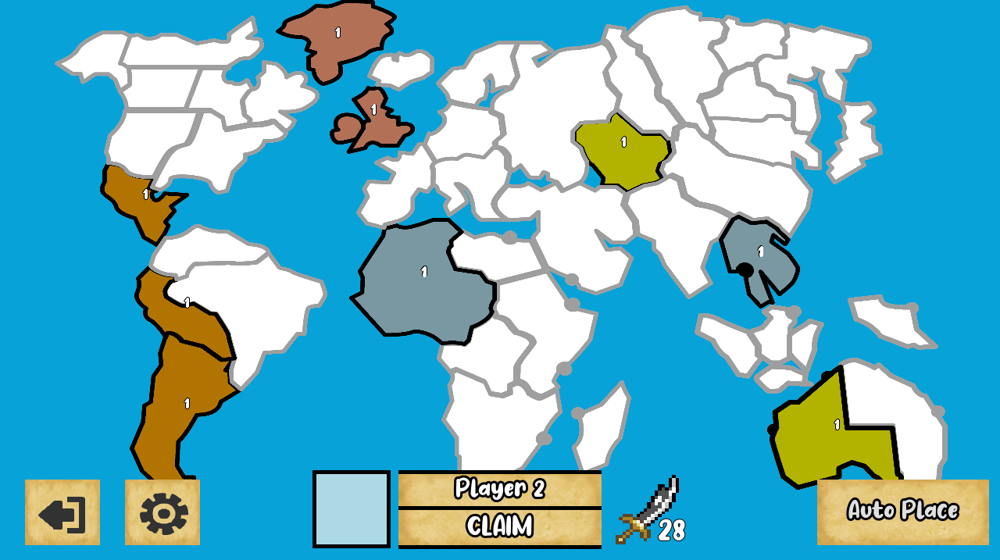
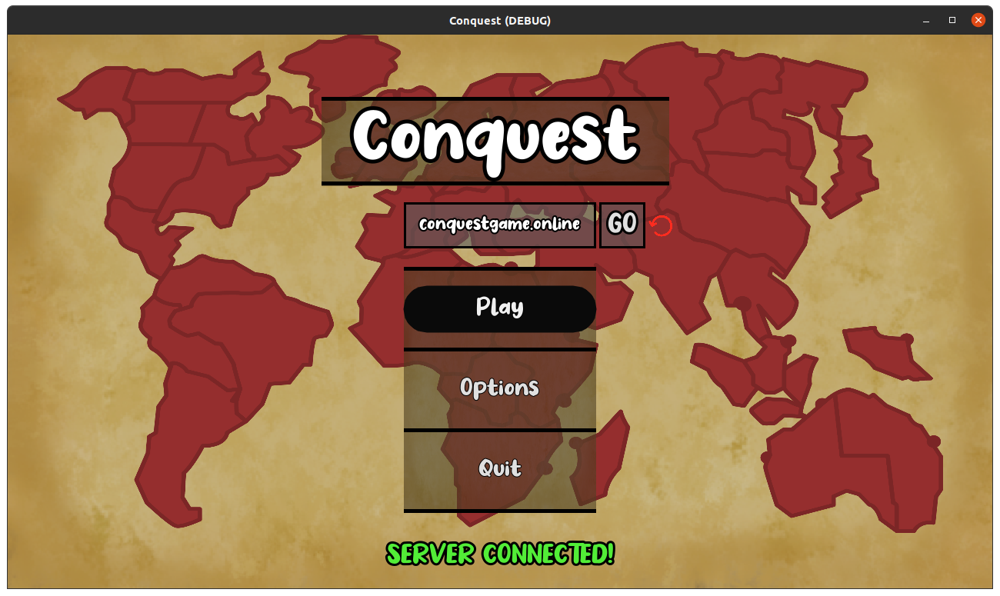
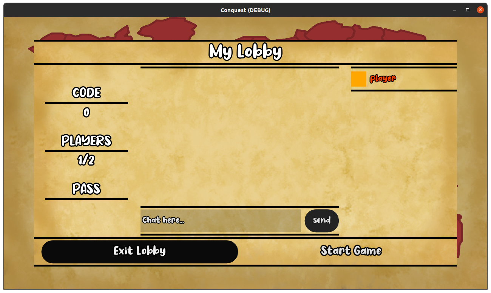
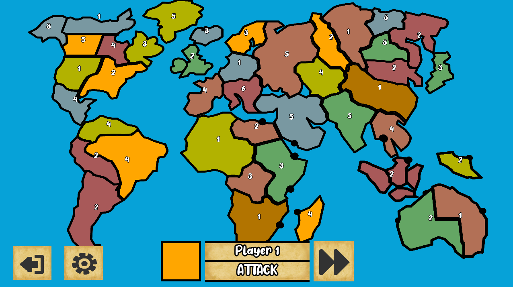

# Conquest

### [Live Demo](http://conquestgame.online)

Conquest is an open source strategy game similar to Risk and written in Godot.

# Online
To play: install and run [Godot](https://godotengine.org/download), download the project code from GitHub, and import and run from Godot. 

There is a public multiplayer server running at `conquestgame.online`.

# Links
- [Server code and documentation](https://github.com/argosopentech/Conquest-server)
- Videos ([Gameplay](https://www.youtube.com/watch?v=zNjZFWyaR-M), [Multiplayer](https://www.youtube.com/watch?v=PQDjDbVymX0))

# About
Developed by [Wamiq Ur Rehman](https://wamiqurrehman.wordpress.com/) for [Argos Open Tech](https://www.argosopentech.com).

# License
Licensed under either the MIT license or CC0, [donations](https://github.com/sponsors/argosopentech) appreciated.
